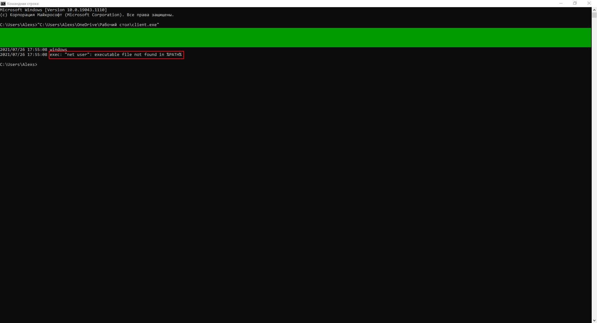
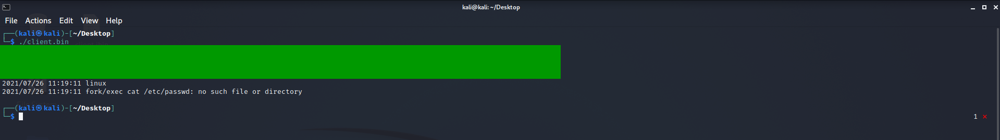
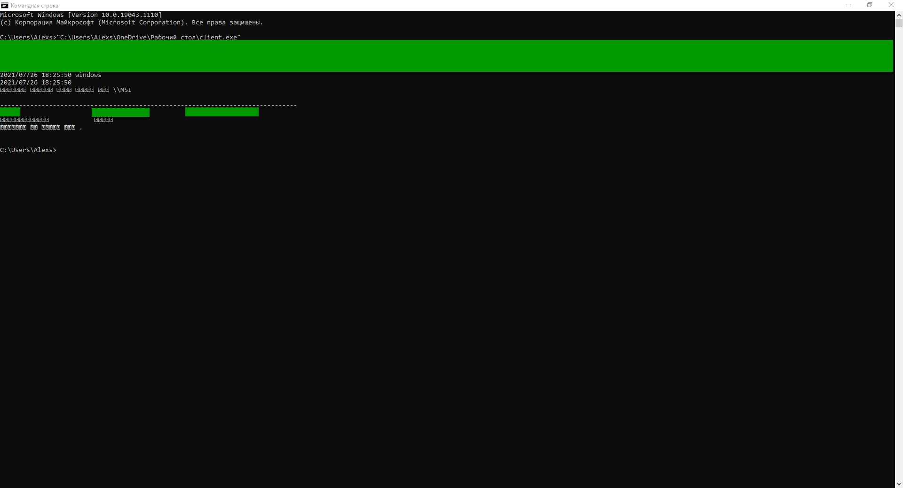

# 1. Исходный код вашего приложения

``` go
package main

import (
	"encoding/json"
	"log"
	"os"
	"os/exec"
	"os/user"
	"runtime"
)

func main() {
	current, err := user.Current()
	// err + Tab напишет за вас
	if err != nil {
		log.Print(err)
		// завершает работу с ненулевым кодом возврата
		os.Exit(1)
		// т.е. следующая строка исполнена не будет
	}

	// выполняем только если не зашли в if
	data, err := json.Marshal(current)
	if err != nil {
		log.Print(err)
		os.Exit(1)
	}
	log.Print(data)         // распечатаются "байты"
	log.Print(string(data)) // преобразовываем слайс байт в строку

	log.Print(runtime.GOOS)


	command := "cat /etc/passwd"
	sh := "sh"
	c := "-c"
	if runtime.GOOS == "windows" {
		command = "net user"
		sh = "cmd"
		c = "/C"
	}
	cmd := exec.Command(sh, c, command)
	output, err := cmd.Output() // запускает команду и возвращает вывод в виде []byte
	if err != nil {
		log.Print(err)
		os.Exit(1)
	}
	log.Print(string(output))
}
```

# 2. Ответ на вопрос по поводу sh -c и cmd /C

Найти внятного ответа не получилось, но без sh -c и cmd /C командная строка, что в Windows, что в Linux выводит примерно одинаковую ошибку "Not found", предполагаю, что данные команды sh/cmd с флагом "-c"/"/C" указывают на то, что искать нужно во всех директориях, но скорее всего предположение не верное.




# 3. Сборочный скрипт

``` sh
#!/bin/sh

GOARCH=amd64 CGO_ENABLED=0 GOOS=windows go build -o client.exe main.go

GOARCH=amd64 CGO_ENABLED=0 GOOS=linux go build -o client.bin main.go
```

# 4. Пример вывода вашей программы в ОС Windows

